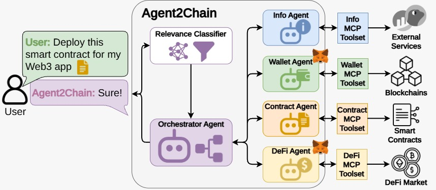

# Agent2Chain

Agent2Chain is a Python application that combines Google ADK, LLMs and
the Model Context Protocol (MCP) to provide a conversational interface for
EVM-compatible blockchain environments.

## Features

- Conversational blockchain assistant with context about the connected wallet.
- Three knowledge levels: Beginner, Intermediate and Expert.
- Wallet-aware actions through MetaMask, including native transfers and
	interaction with deployed contracts.
- Blockchain information such as prices, gas fees, transaction details, TVL and
	DeFi rates.
- Smart-contract utilities: generate a Solidity contract, list deployed
	contracts and inspect a registered contract.
- Solidity deployment and contract auditing from the web UI.
- DeFi operations on the supported networks and protocols, including lending,
	borrowing, staking, withdrawals, repayments, approvals and balance checks.
- An Info Panel that exposes agent handoffs, tool calls and tool results.
- Structured JSONL activity logs and dataset runners for repeatable evaluation.

## Agents

The application is organized around one root agent and four specialized
subagents:

- `orchestrator_agent`: root coordinator. It keeps wallet and knowledge-level
	context and delegates requests.
- `info_agent`: prices, gas, transaction history/details, TVL and rates.
- `metamask_agent`: prepares native transactions and contract interactions for
	MetaMask.
- `contract_agent`: writes, audits, lists and describes contracts without
	directly changing blockchain state.
- `defi_agent`: handles supported DeFi workflows. DeFi actions are blocked for
	Beginner users.



## Repository Structure

```text
BlockchainAgentADK/
├── README.md
├── pyproject.toml                 # Python package and dependencies
├── run.sh                          # Environment setup and UI startup
├── src/
│   ├── UI/
│   │   ├── server.py              # HTTP server and JSON API
│   │   ├── index.html              # Web application
│   │   ├── app.js                  # Browser and MetaMask logic
│   │   └── styles.css
│   ├── agents/BlockchainAgent/
│   │   ├── agent.py                # Root agent, runner and session
│   │   ├── subagents/              # Info, MetaMask, contract and DeFi agents
│   │   └── plugin/                 # Activity logger and safety judge
│   ├── mcp/
│   │   ├── BlockchainInfoTools/
│   │   ├── MetaMaskTools/
│   │   ├── ContractTools/
│   │   └── DeFiTools/
│   └── utils/                      # Prompts, chains, policy and tool helpers
├── datasets/                       # Evaluation datasets (local, ignored)
```

Runtime-generated data is kept outside `src`:

- `.logs/`: structured activity events in JSONL format.
- `.data/`: local contract registry, including
	`.data/contracts.storage.json`.
- `.reports/`: generated smart-contract audit reports.
- `.generated-contracts/`: generated Solidity sources and related artifacts.

## Requirements

- Python 3.10 or newer.
- A browser with the MetaMask extension for wallet operations.
- API access for the selected LLM model.
- `uv` is recommended for dependency and virtual-environment management.
- Ganache is optional for local testing.

## Configuration

Create `src/.env` resembling the `src/.env.example` file with the API keys you need. 
The default agent configuration uses LiteLLM with the Claude model configured 
in `src/agents/BlockchainAgent/agent.py`.You can select whatever model you prefer.

The keys are used as follows:

- `ANTHROPIC_API_KEY`: authentication for the configured Claude model.
- `INFURA_API_KEY`: RPC URLs for networks whose primary endpoint uses Infura.
- `ETHERSCAN_API_KEY`: optional higher-rate explorer requests.
- `CHAINGPT_API_KEY`: required by the smart-contract audit action.
- `BITCOMPARE_API_KEY`: optional authentication for DeFi rates.
- `OLLAMA_API_BASE`: endpoint used by local Ollama evaluation/classification.
- `UI_HOST` and `UI_PORT`: bind address and port of the web server.
- `SOLC_VERSION`: optional Solidity compiler version for deployment.

### Optional Ganache Configuration

For local Ganache testing, use `http://127.0.0.1:7545` and configure MetaMask
with chain ID `1337` or `5777`, matching the active Ganache configuration.

## Run the Application

### Recommended launcher

From the repository root, run:

```bash
bash run.sh
```

The launcher creates or reuses `.venv`, synchronizes dependencies with `uv`
when available, creates `.logs/`, loads `src/.env` and starts the UI server.

Open [http://127.0.0.1:8080](http://127.0.0.1:8080) in a browser. The default
host and port can be changed with `UI_HOST` and `UI_PORT`.

## Using the UI

1. Open the local URL and connect MetaMask.
2. Select the network required by the request in MetaMask.
3. Ask the assistant for information or an action, for example:
	 - `Show my balance`
	 - `What is the current gas price?`
	 - `Show my last transactions`
	 - `Send 0.01 ETH to 0x...`
	 - `List my deployed contracts`
	 - `Switch to Expert level`

The agent adapts its explanations to the selected knowledge level:

- **Beginner**: detailed guidance and simple language. DeFi actions are not
	available.
- **Intermediate**: balanced guidance and technical detail.
- **Expert**: concise, technical responses with less introductory guidance.

## Troubleshooting

- **MCP connection closed**: verify that the project `.venv` exists and that
	the MCP subprocesses use its Python executable. Restart the application after
	changing dependencies or environment variables.
- **Missing API key**: check `src/.env` and restart the server.
- **Transaction rejected**: ensure MetaMask is connected to the requested
	network and that the account has enough native currency for value and gas.
- **RPC failures**: configure the corresponding network-specific RPC override
	or add `INFURA_API_KEY`; public fallback endpoints may be rate-limited.

## Security Notes

This project is intended for development, testing and research. Always inspect
transaction parameters before approving them in MetaMask, use testnets for
experiments, and never provide private keys or seed phrases to the application.
Contract generation and auditing are assistive features and do not replace a
professional smart-contract security review.